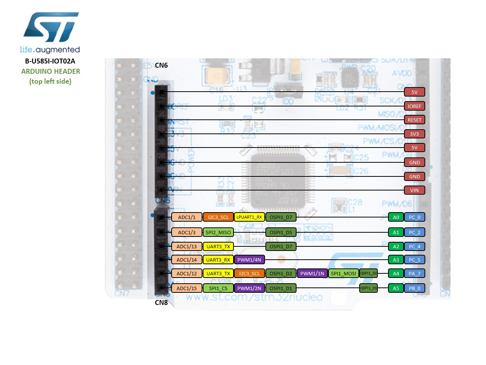
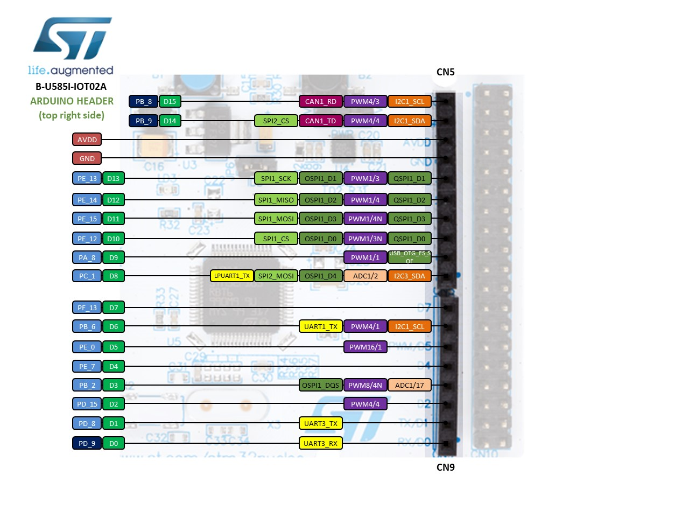
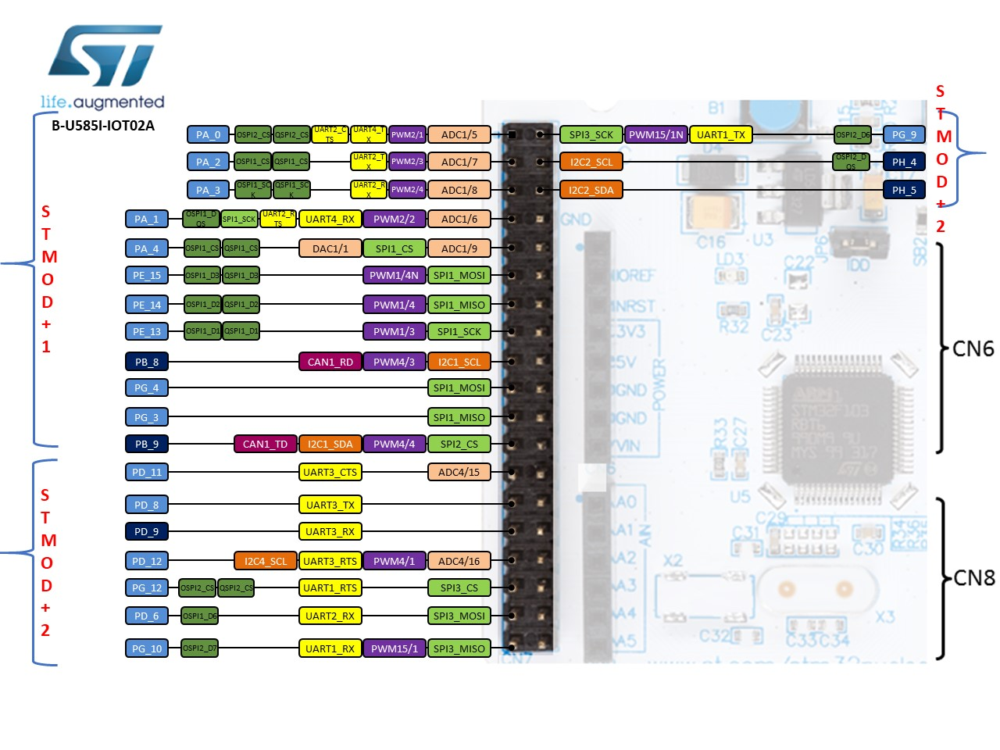
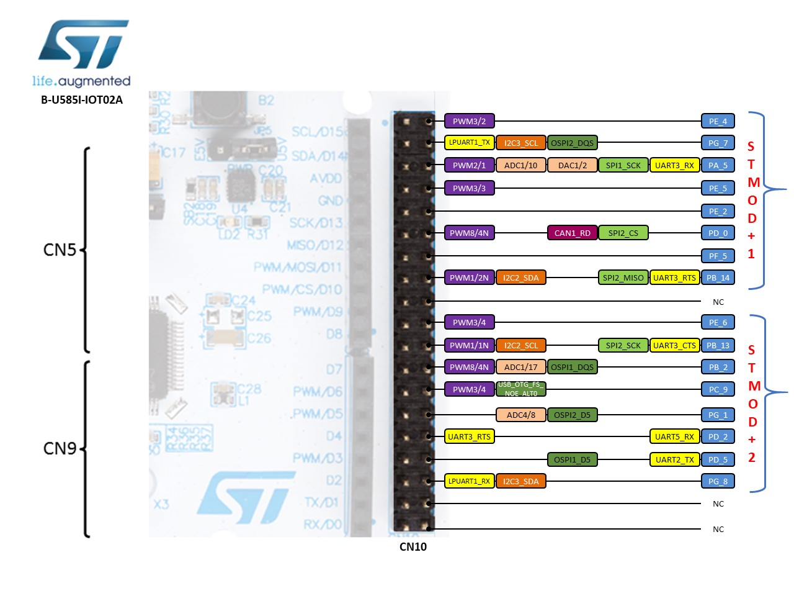

# Overview

The B-U585I-IOT02A Discovery kit provides a complete demonstration and development platform for the STM32U585AI
microcontroller, featuring an Arm Cortex-M33 core, 2 Mbytes of Flash memory and 786 Kbytes of SRAM, as well as smart
peripheral resources. This Discovery kit enables a wide diversity of applications by exploiting low-power communication,
multi way sensing, and direct connection to cloud servers.

It includes Wi-Fi® and Bluetooth® modules, as well as microphones, temperature and humidity, magnetometer, accelerometer and
gyroscope, pressure, time-of-flight, and gesture-detection sensors.

The support for ARDUINO® Uno V3, STMod+, and Pmod™ connectivity provides unlimited expansion capabilities with a large
choice of specialized add-on boards. The on-board STLINK-V3E debugger provides out-of-the-box debugging capabilities, as
well as a USB Virtual COM port bridge.

# Board pinout

## Pins Legend

# Getting started

- [User manual](https://www.st.com/resource/en/user_manual/um2839-discovery-kit-for-iot-node-with-stm32u5-series-stmicroelectronics.pdf)

## ST-LINK driver installation and firmware upgrade

1. Download the latest [ST-LINK driver](https://www.st.com/en/development-tools/stsw-link009.html).
2. Extract the archive and run `dpinst_amd64.exe`. Follow the displayed instructions.
3. Download the latest [ST-LINK firmware upgrade](https://www.st.com/en/development-tools/stsw-link007.html).
4. Extract the archive and run the STLinkUpgrade.exe program.
5. Connect the board to your PC using a USB cable and wait until the USB enumeration is completed.
6. In the **ST-Link Upgrade** program, press the **Device Connect** button.
7. When the ST-LINK driver is correctly installed, the current ST-LINK version is displayed.
8. Press the **Yes >>>>** button to start the firmware upgrade process.

# Technical reference

- [STM32U585AI microcontroller](https://www.st.com/en/microcontrollers-microprocessors/stm32u585ai.html)
- [B-L475E-IOT01A board](https://www.st.com/en/evaluation-tools/B-U585I-IOT02A.html)
- [User manual](https://www.st.com/resource/en/user_manual/um2839-discovery-kit-for-iot-node-with-stm32u5-series-stmicroelectronics.pdf)
- [Data brief](https://www.st.com/resource/en/data_brief/b-u585i-iot02a.pdf)
- [Schematic](https://www.st.com/resource/en/schematic_pack/mb1551-u585i-c02_schematic.pdf)
